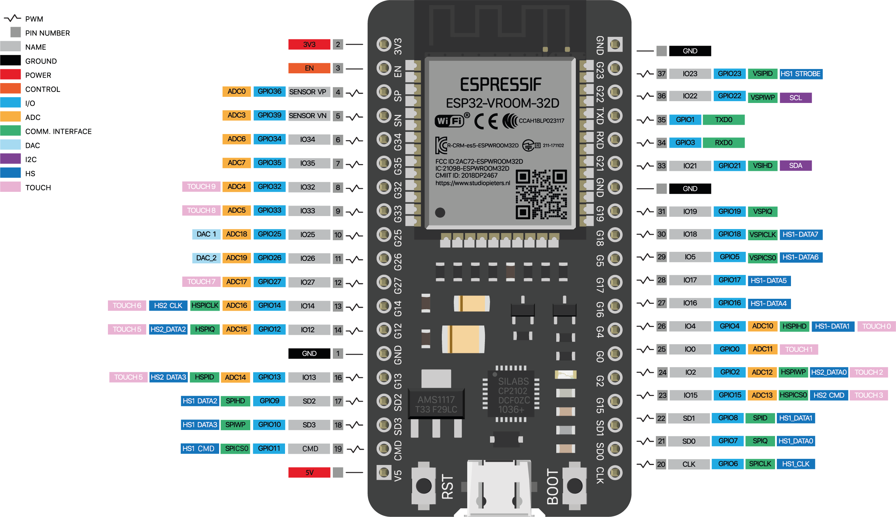

# ESP32-S3 with Display module

## To change the target compilation

- change platformio.ini -D XXX
- add tabs.h defines for NUMBER_TABS, and Tab names
- add tabs into tabs.cpp defines

## To program from laptop

From `c:\git\electronic\PlatformIO` run:

```bash
git add .
git commit -m "Vendor SimpleFTPServer library with OPTS and Debug patches"
git push gdrive --mirror
```

On the laptop from `e:\git\electronic\PlatformIO` run:

```bash
git fetch origin
git reset --hard origin/master
```

## Selection

Select the device to compile to in platformio.ini in the build flags

## manual compilation

- md5sum  .\.pio\build\Display\firmware.bin 
- python -m esptool --chip esp32s3 --port COM8 erase_flash
- python -m esptool --chip esp32s3 --port COM8 write_flash 0x8000 .\.pio\build\Display\partitions.bin  
- python -m esptool --chip esp32s3 --port COM8 read_flash 0x8000 0x7000 partitions.bin
- hexdump -C .\partitions.bin

## 36-Pin ESP32 Links

- <https://randomnerdtutorials.com/esp32-pinout-reference-gpios/>
- <https://www.studiopieters.nl/esp32-pinout>

## 36-Pin ESP32 Module


<div style="background-color: white; display: inline-block;color:black">

<p>The pins highlighted in <strong><span style="color: #339966;">green</span></strong> are OK to use. The ones highlighted in <strong><span style="color: #ffcc00;">yellow</span></strong> are OK to use, <strong><span style="color: #ff9900;">but you need to pay attention because they may have unexpected behaviour, mainly at boot</span></strong>. The pins highlighted in<strong><span style="color: #ff0000;"> red</span></strong> are not recommended to use as inputs or outputs.</p>
<figure class="wp-block-table"><table><tbody><tr><td><strong>GPIO</strong></td><td><strong>Input</strong></td><td><strong>Output</strong></td><td><strong>Notes</strong></td></tr><tr><td>0</td><td><strong><span style="color: #ffcc00;">pulled up</span></strong></td><td><strong><span style="color: #ffcc00;">OK</span></strong></td><td>outputs PWM signal at boot</td></tr><tr><td>1</td><td><strong><span style="color: #ff0000;">TX Pin</span></strong></td><td><strong><span style="color: #ffcc00;">OK</span></strong></td><td>debug output at boot</td></tr><tr><td>2</td><td><strong><span style="color: #339966;">OK</span></strong></td><td><strong><span style="color: #339966;">OK</span></strong></td><td>connected to on-board LED</td></tr><tr><td>3</td><td><strong><span style="color: #ffcc00;">OK</span></strong></td><td><strong><span style="color: #ff0000;">RX Pin</span></strong></td><td>HIGH at boot</td></tr><tr><td>4</td><td><strong><span style="color: #339966;">OK</span></strong></td><td><strong><span style="color: #339966;">OK</span></strong></td><td>&nbsp;</td></tr><tr><td>5</td><td><strong><span style="color: #339966;">OK</span></strong></td><td><strong><span style="color: #339966;">OK</span></strong></td><td>outputs PWM signal at boot</td></tr><tr><td>6</td><td><strong><span style="color: #ff0000;">X</span></strong></td><td><strong><span style="color: #ff0000;">X</span></strong></td><td>connected to the integrated SPI flash</td></tr><tr><td>7</td><td><strong><span style="color: #ff0000;">X</span></strong></td><td><strong><span style="color: #ff0000;">X</span></strong></td><td>connected to the integrated SPI flash</td></tr><tr><td>8</td><td><strong><span style="color: #ff0000;">X</span></strong></td><td><strong><span style="color: #ff0000;">X</span></strong></td><td>connected to the integrated SPI flash&nbsp;connected to the integrated SPI flash</td></tr><tr><td>9</td><td><strong><span style="color: #ff0000;">X</span></strong></td><td><strong><span style="color: #ff0000;">X</span></strong></td><td>connected to the integrated SPI flash</td></tr><tr><td>10</td><td><strong><span style="color: #ff0000;">X</span></strong></td><td><strong><span style="color: #ff0000;">X</span></strong></td><td>connected to the integrated SPI flash</td></tr><tr><td>11</td><td><strong><span style="color: #ff0000;">X</span></strong></td><td><strong><span style="color: #ff0000;">X</span></strong></td><td>connected to the integrated SPI flash</td></tr><tr><td>12</td><td><strong><span style="color: #ffcc00;">OK</span></strong></td><td><strong><span style="color: #339966;">OK</span></strong></td><td>&nbsp;</td></tr><tr><td>13</td><td><strong><span style="color: #339966;">OK</span></strong></td><td><strong><span style="color: #339966;">OK</span></strong></td><td>outputs PWM signal at boot</td></tr><tr><td>14</td><td><strong><span style="color: #339966;">OK</span></strong></td><td><strong><span style="color: #339966;">OK</span></strong></td><td>outputs PWM signal at boot</td></tr><tr><td>15</td><td><strong><span style="color: #339966;">OK</span></strong></td><td><strong><span style="color: #339966;">OK</span></strong></td><td>&nbsp;</td></tr><tr><td>16</td><td><strong><span style="color: #339966;">OK</span></strong></td><td><strong><span style="color: #339966;">OK</span></strong></td><td>&nbsp;</td></tr><tr><td>17</td><td><strong><span style="color: #339966;">OK</span></strong></td><td><strong><span style="color: #339966;">OK</span></strong></td><td>&nbsp;</td></tr><tr><td>18</td><td><strong><span style="color: #339966;">OK</span></strong></td><td><strong><span style="color: #339966;">OK</span></strong></td><td>&nbsp;</td></tr><tr><td>19</td><td><strong><span style="color: #339966;">OK</span></strong></td><td><strong><span style="color: #339966;">OK</span></strong></td><td>&nbsp;</td></tr><tr><td>20</td><td><strong><span style="color: #339966;">OK</span></strong></td><td><strong><span style="color: #339966;">OK</span></strong></td><td>&nbsp;</td></tr><tr><td>21</td><td><strong><span style="color: #339966;">OK</span></strong></td><td><strong><span style="color: #339966;">OK</span></strong></td><td>&nbsp;</td></tr><tr><td>22</td><td><strong><span style="color: #339966;">OK</span></strong></td><td><strong><span style="color: #339966;">OK</span></strong></td><td>&nbsp;</td></tr><tr><td>23</td><td><strong><span style="color: #339966;">OK</span></strong></td><td><strong><span style="color: #339966;">OK</span></strong></td><td>&nbsp;</td></tr><tr><td>24</td><td><strong><span style="color: #339966;">OK</span></strong></td><td><strong><span style="color: #339966;">OK</span></strong></td><td>&nbsp;</td></tr><tr><td>25</td><td><strong><span style="color: #339966;">OK</span></strong></td><td><strong><span style="color: #339966;">OK</span></strong></td><td>&nbsp;</td></tr><tr><td>26</td><td><strong><span style="color: #339966;">OK</span></strong></td><td><strong><span style="color: #339966;">OK</span></strong></td><td>&nbsp;</td></tr><tr><td>27</td><td><strong><span style="color: #339966;">OK</span></strong></td><td><strong><span style="color: #339966;">OK</span></strong></td><td>&nbsp;</td></tr><tr><td>28</td><td><strong><span style="color: #339966;">OK</span></strong></td><td><strong><span style="color: #339966;">OK</span></strong></td><td>&nbsp;</td></tr><tr><td>29</td><td><strong><span style="color: #339966;">OK</span></strong></td><td><strong><span style="color: #339966;">OK</span></strong></td><td>&nbsp;</td></tr><tr><td>30</td><td><strong><span style="color: #339966;">OK</span></strong></td><td><strong><span style="color: #339966;">OK</span></strong></td><td>&nbsp;</td></tr><tr><td>31</td><td><strong><span style="color: #339966;">OK</span></strong></td><td><strong><span style="color: #339966;">OK</span></strong></td><td>&nbsp;</td></tr><tr><td>32</td><td><strong><span style="color: #339966;">OK</span></strong></td><td><strong><span style="color: #339966;">OK</span></strong></td><td>&nbsp;</td></tr><tr><td>33</td><td><strong><span style="color: #339966;">OK</span></strong></td><td><strong><span style="color: #339966;">OK</span></strong></td><td>&nbsp;</td></tr><tr><td>34</td><td><strong><span style="color: #339966;">OK</span></strong></td><td>&nbsp;</td><td>&nbsp;</td></tr><tr><td>35</td><td><strong><span style="color: #339966;">OK</span></strong></td><td>&nbsp;</td><td>&nbsp;</td></tr><tr><td>36</td><td><strong><span style="color: #339966;">OK</span></strong></td><td>&nbsp;</td><td><strong><span style="color: #ffcc00;">input only</span></strong></td></tr><tr><td>37</td><td><strong><span style="color: #339966;">OK</span></strong></td><td>&nbsp;</td><td><strong><span style="color: #ffcc00;">input only</span></strong></td></tr><tr><td>38</td><td><strong><span style="color: #339966;">OK</span></strong></td><td>&nbsp;</td><td><strong><span style="color: #ffcc00;">input only</span></strong></td></tr><tr><td>39</td><td><strong><span style="color: #339966;">OK</span></strong></td><td>&nbsp;</td><td><strong><span style="color: #ffcc00;">input only</span></strong></td></tr></tbody></table></figure>
</div>


## S3 Modules Links

- <http://wiki.fluidnc.com/en/hardware/ESP32-S3_Pin_Reference>
- <https://docs.espressif.com/projects/esp-idf/en/stable/esp32s3/hw-reference/esp32s3/user-guide-devkitc-1.html>

## ESP32-S3 Module


<div class="contents"><div><h1 id="esp32-s3-pin-reference" class="toc-header"><a href="#esp32-s3-pin-reference" class="toc-anchor">¶</a> ESP32-S3 Pin Reference</h1> <ul><li><a href="https://docs.espressif.com/projects/esp-idf/en/latest/esp32s3/hw-reference/esp32s3/user-guide-devkitc-1.html" class="is-external-link">Espressif user guide</a></li> <li><a href="https://dl.espressif.com/dl/schematics/SCH_ESP32-S3-DevKitC-1_V1.1_20220413.pdf" class="is-external-link">Schematic</a></li> <li><a href="https://www.espressif.com/sites/default/files/documentation/esp32-s3-wroom-1_wroom-1u_datasheet_en.pdf" class="is-external-link">ESP32-S3-WROOM-1 Datasheet (Module)</a></li> <li><a href="https://www.espressif.com/sites/default/files/documentation/esp32-s3_datasheet_en.pdf" class="is-external-link">ESP32-S3 Family Datasheet</a></li> <li><a href="https://www.espressif.com/sites/default/files/documentation/esp32-s3_technical_reference_manual_en.pdf" class="is-external-link">ESP32-S3 Technical Reference Manual</a></li> <li><a href="https://api.riot-os.org/group__cpu__esp32__esp32s3.html" class="is-external-link">ESP32 S3 Family Pins</a></li></ul> <p></p> <blockquote class="is-warning"><p>This is incomplete and just a collection point for information as it is collected.</p></blockquote> <h2 id="part-numbering" class="toc-header"><a href="#part-numbering" class="toc-anchor">¶</a> Part Numbering</h2> <ul><li><code>-1</code> and <code>-1U</code> This indicates the antenna type
<ul><li><code>-1</code> has an PCB antenna</li> <li><code>-1U</code> has an external antenna connector</li></ul></li> <li><code>Nx, Rx, Hx</code> <ul><li><code>Nx</code> is the SPI Flash size</li> <li><code>Rx</code> is the PSRAM size</li> <li><code>Hx</code> is an extended temp FLASH version</li></ul></li></ul> <h3 id="examples" class="toc-header"><a href="#examples" class="toc-anchor">¶</a> Examples:</h3> <ul><li><strong>ESP32-S3-WROOM-1-N8</strong> PCB antenna with 8M Flash</li> <li><strong>ESP32-S3-WROOM-1U-N8R8</strong> External antenns connector, 8M FLASH, 8M PSRAM</li></ul> <h2 id="usable-io-pins" class="toc-header"><a href="#usable-io-pins" class="toc-anchor">¶</a> Usable I/O pins</h2> <ul><li>gpio.0 (See strapping pins)</li> <li>gpio.1</li> <li>gpio.2</li> <li>gpio.3 (See strapping pins)</li> <li>gpio.4 Weak pull up on reset</li> <li>gpio.5</li> <li>gpio.6</li> <li>gpio.7</li> <li>gpio.8</li> <li>gpio.9</li> <li>gpio.10</li> <li>gpio.11</li> <li>gpio.12</li> <li>gpio.13</li> <li>gpio.14</li> <li>gpio.15</li> <li>gpio.16</li> <li>gpio.17</li> <li>gpio.18</li> <li>gpio.19 Used for native USB D-</li> <li>gpio.20 Used for native USB D+</li> <li>gpio.21</li> <li>gpio.35 Used for PSRAM, weak pull up on reset</li> <li>gpio.36 Used for PSRAM</li> <li>gpio.37 Used for PSRAM</li> <li>gpio.38</li> <li>gpio.39</li> <li>gpio.40</li> <li>gpio.41</li> <li>gpio.42</li> <li>gpio.45 (See strapping pins)</li> <li>gpio.46 (See strapping pins)</li> <li>gpio.47</li> <li>gpio.48</li></ul> <h2 id="do-not-use-generally" class="toc-header"><a href="#do-not-use-generally" class="toc-anchor">¶</a> Do Not Use (generally)</h2> <ul><li>gpio.19 Used for native USB D-</li> <li>gpio.20 Used for native USB D+</li> <li>gpio.43 Used for USB/Serial U0TXD</li> <li>gpio.44 Used for USB Serial U0RXD</li></ul> <p>If you have PSRAM, you also cannot use gpio.35 - gpio.37 .</p> <h2 id="strapping-pins" class="toc-header"><a href="#strapping-pins" class="toc-anchor">¶</a> Strapping Pins</h2> <p>Typically these can be used, but you need to make sure they are not in the wrong state during boot.</p> <ul><li>gpio.0 Boot Mode. Weak pullup during reset. (Boot Mode 0=Boot from Flash, 1=Download)</li> <li>gpio.3 JTAG Mode. Weak pull down during reset. (JTAG Config)</li> <li>gpio.45 SPI Flash voltage. Weak pull down during reset. (SPI Voltage 0=3.3v 1=1.8v)</li> <li>gpio.46 Boot mode. Weak pull down during reset. (Enabling/Disabling ROM Messages Print During Booting)</li></ul> <p>While not recommended, it is possible to burn the SPI voltage in a EFuse, effectively ignoring gpio.45. See <a href="https://docs.espressif.com/projects/esp-idf/en/stable/esp32s3/api-reference/system/efuse.html" class="is-external-link">Espressif EFuse docs</a> for more information; look for VDD_SPI .</p> <h2 id="default-pins" class="toc-header"><a href="#default-pins" class="toc-anchor">¶</a> Default Pins</h2> <p>These pins are the default pins, however they can be remapped to any other gpio.</p> <h4 id="i2c" class="toc-header"><a href="#i2c" class="toc-anchor">¶</a> I2C</h4> <p>Default pins in the Arduino framework are:</p> <ul><li>gpio.9 SCL</li> <li>gpio.8 SDA</li></ul> <p>I2C can be mapped to any available gpio pin without a penalty.</p> <p>There is an aditional I2C interface which does not seem to have default pins.</p> <h4 id="spi" class="toc-header"><a href="#spi" class="toc-anchor">¶</a> SPI</h4> <p>The ESP32 S3 has four SPI interfaces which are:</p> <ul><li>SPI0 used by ESP32-S3’s cache and Crypto DMA (EDMA) to access in-package or off-package flash/PSRAM</li> <li>SPI1 used by the CPU to access in-package or off-package flash/PSRAM</li> <li>SPI2 is a general purpose SPI controller with its own DMA channel</li> <li>SPI3 is a general purpose SPI controller with access to a DMA channel shared between several peripherals</li></ul> <p>The SPI2 (VSPI) default pins are:</p> <ul><li>gpio.12 SCK Defined as SPI0_SCK</li> <li>gpio.11 MOSI Defined as SPI0_MOSI</li> <li>gpio.13 MISO Defined as SPI0_MISO</li> <li>gpio.10 CSO Defined as SPI_CS0</li></ul> <p>These default pins run through the IOMUX instead of the GPIO matrix, and therefore have higher<br>
performance characteristics. The maximum frequency for IOMUX pins is 80 MHz.</p> <p>SPI3 does not have default pin mappings because it can be mapped to any available gpio pins.</p> <h4 id="i2s" class="toc-header"><a href="#i2s" class="toc-anchor">¶</a> I2S</h4> <p>The ESP32 S3 has two I2S interfaces which can be mapped to any available gpio pins.</p></div></div>


<table class="markdownTable">
<tbody><tr class="markdownTableHead">
<th class="markdownTableHeadNone">Pin   </th><th class="markdownTableHeadLeft">Type   </th><th class="markdownTableHeadCenter">ADC   </th><th class="markdownTableHeadCenter">RTC   </th><th class="markdownTableHeadCenter">PU / PD   </th><th class="markdownTableHeadNone">Special function   </th><th class="markdownTableHeadNone">Remarks    </th></tr>
<tr class="markdownTableRowOdd">
<td class="markdownTableBodyNone">GPIO0   </td><td class="markdownTableBodyLeft">In/Out   </td><td class="markdownTableBodyCenter">-   </td><td class="markdownTableBodyCenter">X   </td><td class="markdownTableBodyCenter">X   </td><td class="markdownTableBodyNone">-   </td><td class="markdownTableBodyNone">Bootstrapping    </td></tr>
<tr class="markdownTableRowEven">
<td class="markdownTableBodyNone">GPIO1   </td><td class="markdownTableBodyLeft">In/Out   </td><td class="markdownTableBodyCenter">X   </td><td class="markdownTableBodyCenter">X   </td><td class="markdownTableBodyCenter">X   </td><td class="markdownTableBodyNone">-   </td><td class="markdownTableBodyNone">-    </td></tr>
<tr class="markdownTableRowOdd">
<td class="markdownTableBodyNone">GPIO2   </td><td class="markdownTableBodyLeft">In/Out   </td><td class="markdownTableBodyCenter">X   </td><td class="markdownTableBodyCenter">X   </td><td class="markdownTableBodyCenter">X   </td><td class="markdownTableBodyNone">-   </td><td class="markdownTableBodyNone">-    </td></tr>
<tr class="markdownTableRowEven">
<td class="markdownTableBodyNone">GPIO3   </td><td class="markdownTableBodyLeft">In/Out   </td><td class="markdownTableBodyCenter">X   </td><td class="markdownTableBodyCenter">X   </td><td class="markdownTableBodyCenter">X   </td><td class="markdownTableBodyNone">-   </td><td class="markdownTableBodyNone">Bootstrapping    </td></tr>
<tr class="markdownTableRowOdd">
<td class="markdownTableBodyNone">GPIO4   </td><td class="markdownTableBodyLeft">In/Out   </td><td class="markdownTableBodyCenter">X   </td><td class="markdownTableBodyCenter">X   </td><td class="markdownTableBodyCenter">X   </td><td class="markdownTableBodyNone">-   </td><td class="markdownTableBodyNone">-    </td></tr>
<tr class="markdownTableRowEven">
<td class="markdownTableBodyNone">GPIO5   </td><td class="markdownTableBodyLeft">In/Out   </td><td class="markdownTableBodyCenter">X   </td><td class="markdownTableBodyCenter">X   </td><td class="markdownTableBodyCenter">X   </td><td class="markdownTableBodyNone">-   </td><td class="markdownTableBodyNone">-    </td></tr>
<tr class="markdownTableRowOdd">
<td class="markdownTableBodyNone">GPIO6   </td><td class="markdownTableBodyLeft">In/Out   </td><td class="markdownTableBodyCenter">X   </td><td class="markdownTableBodyCenter">X   </td><td class="markdownTableBodyCenter">X   </td><td class="markdownTableBodyNone">-   </td><td class="markdownTableBodyNone">-    </td></tr>
<tr class="markdownTableRowEven">
<td class="markdownTableBodyNone">GPIO7   </td><td class="markdownTableBodyLeft">In/Out   </td><td class="markdownTableBodyCenter">X   </td><td class="markdownTableBodyCenter">X   </td><td class="markdownTableBodyCenter">X   </td><td class="markdownTableBodyNone">-   </td><td class="markdownTableBodyNone">-    </td></tr>
<tr class="markdownTableRowOdd">
<td class="markdownTableBodyNone">GPIO8   </td><td class="markdownTableBodyLeft">In/Out   </td><td class="markdownTableBodyCenter">X   </td><td class="markdownTableBodyCenter">X   </td><td class="markdownTableBodyCenter">X   </td><td class="markdownTableBodyNone">-   </td><td class="markdownTableBodyNone">-    </td></tr>
<tr class="markdownTableRowEven">
<td class="markdownTableBodyNone">GPIO9   </td><td class="markdownTableBodyLeft">In/Out   </td><td class="markdownTableBodyCenter">X   </td><td class="markdownTableBodyCenter">X   </td><td class="markdownTableBodyCenter">X   </td><td class="markdownTableBodyNone">-   </td><td class="markdownTableBodyNone">-    </td></tr>
<tr class="markdownTableRowOdd">
<td class="markdownTableBodyNone">GPIO10   </td><td class="markdownTableBodyLeft">In/Out   </td><td class="markdownTableBodyCenter">X   </td><td class="markdownTableBodyCenter">X   </td><td class="markdownTableBodyCenter">X   </td><td class="markdownTableBodyNone">-   </td><td class="markdownTableBodyNone">-    </td></tr>
<tr class="markdownTableRowEven">
<td class="markdownTableBodyNone">GPIO11   </td><td class="markdownTableBodyLeft">In/Out   </td><td class="markdownTableBodyCenter">X   </td><td class="markdownTableBodyCenter">X   </td><td class="markdownTableBodyCenter">X   </td><td class="markdownTableBodyNone">-   </td><td class="markdownTableBodyNone">-    </td></tr>
<tr class="markdownTableRowOdd">
<td class="markdownTableBodyNone">GPIO12   </td><td class="markdownTableBodyLeft">In/Out   </td><td class="markdownTableBodyCenter">X   </td><td class="markdownTableBodyCenter">X   </td><td class="markdownTableBodyCenter">X   </td><td class="markdownTableBodyNone">-   </td><td class="markdownTableBodyNone">-    </td></tr>
<tr class="markdownTableRowEven">
<td class="markdownTableBodyNone">GPIO13   </td><td class="markdownTableBodyLeft">In/Out   </td><td class="markdownTableBodyCenter">X   </td><td class="markdownTableBodyCenter">X   </td><td class="markdownTableBodyCenter">X   </td><td class="markdownTableBodyNone">-   </td><td class="markdownTableBodyNone">-    </td></tr>
<tr class="markdownTableRowOdd">
<td class="markdownTableBodyNone">GPIO14   </td><td class="markdownTableBodyLeft">In/Out   </td><td class="markdownTableBodyCenter">X   </td><td class="markdownTableBodyCenter">X   </td><td class="markdownTableBodyCenter">X   </td><td class="markdownTableBodyNone">-   </td><td class="markdownTableBodyNone">-    </td></tr>
<tr class="markdownTableRowEven">
<td class="markdownTableBodyNone">GPIO15   </td><td class="markdownTableBodyLeft">In/Out   </td><td class="markdownTableBodyCenter">X   </td><td class="markdownTableBodyCenter">X   </td><td class="markdownTableBodyCenter">X   </td><td class="markdownTableBodyNone">XTAL_32K_P   </td><td class="markdownTableBodyNone">External 32k crystal    </td></tr>
<tr class="markdownTableRowOdd">
<td class="markdownTableBodyNone">GPIO16   </td><td class="markdownTableBodyLeft">In/Out   </td><td class="markdownTableBodyCenter">X   </td><td class="markdownTableBodyCenter">X   </td><td class="markdownTableBodyCenter">X   </td><td class="markdownTableBodyNone">XTAL_32K_N   </td><td class="markdownTableBodyNone">External 32k crystal    </td></tr>
<tr class="markdownTableRowEven">
<td class="markdownTableBodyNone">GPIO17   </td><td class="markdownTableBodyLeft">In/Out   </td><td class="markdownTableBodyCenter">X   </td><td class="markdownTableBodyCenter">X   </td><td class="markdownTableBodyCenter">X   </td><td class="markdownTableBodyNone">-   </td><td class="markdownTableBodyNone">-    </td></tr>
<tr class="markdownTableRowOdd">
<td class="markdownTableBodyNone">GPIO18   </td><td class="markdownTableBodyLeft">In/Out   </td><td class="markdownTableBodyCenter">X   </td><td class="markdownTableBodyCenter">X   </td><td class="markdownTableBodyCenter">X   </td><td class="markdownTableBodyNone">-   </td><td class="markdownTableBodyNone">-    </td></tr>
<tr class="markdownTableRowEven">
<td class="markdownTableBodyNone">GPIO19   </td><td class="markdownTableBodyLeft">In/Out   </td><td class="markdownTableBodyCenter">X   </td><td class="markdownTableBodyCenter">X   </td><td class="markdownTableBodyCenter">X   </td><td class="markdownTableBodyNone">USB D-   </td><td class="markdownTableBodyNone">USB 2.0 OTG / USB-JTAG bridge    </td></tr>
<tr class="markdownTableRowOdd">
<td class="markdownTableBodyNone">GPIO20   </td><td class="markdownTableBodyLeft">In/Out   </td><td class="markdownTableBodyCenter">X   </td><td class="markdownTableBodyCenter">X   </td><td class="markdownTableBodyCenter">X   </td><td class="markdownTableBodyNone">USB D+   </td><td class="markdownTableBodyNone">USB 2.0 OTG / USB-JTAG bridge    </td></tr>
<tr class="markdownTableRowEven">
<td class="markdownTableBodyNone">GPIO21   </td><td class="markdownTableBodyLeft">In/Out   </td><td class="markdownTableBodyCenter">-   </td><td class="markdownTableBodyCenter">X   </td><td class="markdownTableBodyCenter">X   </td><td class="markdownTableBodyNone">-   </td><td class="markdownTableBodyNone">-    </td></tr>
<tr class="markdownTableRowOdd">
<td class="markdownTableBodyNone">GPIO26   </td><td class="markdownTableBodyLeft">In/Out   </td><td class="markdownTableBodyCenter">-   </td><td class="markdownTableBodyCenter">-   </td><td class="markdownTableBodyCenter">X   </td><td class="markdownTableBodyNone">Flash/PSRAM SPICS1   </td><td class="markdownTableBodyNone">not available if SPI RAM is used    </td></tr>
<tr class="markdownTableRowEven">
<td class="markdownTableBodyNone">GPIO27   </td><td class="markdownTableBodyLeft">In/Out   </td><td class="markdownTableBodyCenter">-   </td><td class="markdownTableBodyCenter">-   </td><td class="markdownTableBodyCenter">X   </td><td class="markdownTableBodyNone">Flash/PSRAM SPIHD   </td><td class="markdownTableBodyNone">not available    </td></tr>
<tr class="markdownTableRowOdd">
<td class="markdownTableBodyNone">GPIO28   </td><td class="markdownTableBodyLeft">In/Out   </td><td class="markdownTableBodyCenter">-   </td><td class="markdownTableBodyCenter">-   </td><td class="markdownTableBodyCenter">X   </td><td class="markdownTableBodyNone">Flash/PSRAM SPIWP   </td><td class="markdownTableBodyNone">not available    </td></tr>
<tr class="markdownTableRowEven">
<td class="markdownTableBodyNone">GPIO29   </td><td class="markdownTableBodyLeft">In/Out   </td><td class="markdownTableBodyCenter">-   </td><td class="markdownTableBodyCenter">-   </td><td class="markdownTableBodyCenter">X   </td><td class="markdownTableBodyNone">Flash/PSRAM SPICS0   </td><td class="markdownTableBodyNone">not available    </td></tr>
<tr class="markdownTableRowOdd">
<td class="markdownTableBodyNone">GPIO30   </td><td class="markdownTableBodyLeft">In/Out   </td><td class="markdownTableBodyCenter">-   </td><td class="markdownTableBodyCenter">-   </td><td class="markdownTableBodyCenter">X   </td><td class="markdownTableBodyNone">Flash/PSRAM SPICLK   </td><td class="markdownTableBodyNone">not available    </td></tr>
<tr class="markdownTableRowEven">
<td class="markdownTableBodyNone">GPIO31   </td><td class="markdownTableBodyLeft">In/Out   </td><td class="markdownTableBodyCenter">-   </td><td class="markdownTableBodyCenter">-   </td><td class="markdownTableBodyCenter">X   </td><td class="markdownTableBodyNone">Flash/PSRAM SPIQ   </td><td class="markdownTableBodyNone">not available    </td></tr>
<tr class="markdownTableRowOdd">
<td class="markdownTableBodyNone">GPIO32   </td><td class="markdownTableBodyLeft">In/Out   </td><td class="markdownTableBodyCenter">-   </td><td class="markdownTableBodyCenter">-   </td><td class="markdownTableBodyCenter">X   </td><td class="markdownTableBodyNone">Flash/PSRAM SPID   </td><td class="markdownTableBodyNone">not available    </td></tr>
<tr class="markdownTableRowEven">
<td class="markdownTableBodyNone">GPIO33   </td><td class="markdownTableBodyLeft">In/Out   </td><td class="markdownTableBodyCenter">-   </td><td class="markdownTableBodyCenter">-   </td><td class="markdownTableBodyCenter">X   </td><td class="markdownTableBodyNone">Flash/PSRAM SPIQ4   </td><td class="markdownTableBodyNone">not available if octal Flash or SPI RAM is used    </td></tr>
<tr class="markdownTableRowOdd">
<td class="markdownTableBodyNone">GPIO34   </td><td class="markdownTableBodyLeft">In/Out   </td><td class="markdownTableBodyCenter">-   </td><td class="markdownTableBodyCenter">-   </td><td class="markdownTableBodyCenter">X   </td><td class="markdownTableBodyNone">Flash/PSRAM SPIQ5   </td><td class="markdownTableBodyNone">not available if octal Flash or SPI RAM is used    </td></tr>
<tr class="markdownTableRowEven">
<td class="markdownTableBodyNone">GPIO35   </td><td class="markdownTableBodyLeft">In/Out   </td><td class="markdownTableBodyCenter">-   </td><td class="markdownTableBodyCenter">-   </td><td class="markdownTableBodyCenter">X   </td><td class="markdownTableBodyNone">Flash/PSRAM SPIQ6   </td><td class="markdownTableBodyNone">not available if octal Flash or SPI RAM is used    </td></tr>
<tr class="markdownTableRowOdd">
<td class="markdownTableBodyNone">GPIO36   </td><td class="markdownTableBodyLeft">In/Out   </td><td class="markdownTableBodyCenter">-   </td><td class="markdownTableBodyCenter">-   </td><td class="markdownTableBodyCenter">X   </td><td class="markdownTableBodyNone">Flash/PSRAM SPIQ7   </td><td class="markdownTableBodyNone">not available if octal Flash or SPI RAM is used    </td></tr>
<tr class="markdownTableRowEven">
<td class="markdownTableBodyNone">GPIO37   </td><td class="markdownTableBodyLeft">In/Out   </td><td class="markdownTableBodyCenter">-   </td><td class="markdownTableBodyCenter">-   </td><td class="markdownTableBodyCenter">X   </td><td class="markdownTableBodyNone">Flash/PSRAM SPIQ8   </td><td class="markdownTableBodyNone">not available if octal Flash or SPI RAM is used    </td></tr>
<tr class="markdownTableRowOdd">
<td class="markdownTableBodyNone">GPIO38   </td><td class="markdownTableBodyLeft">In/Out   </td><td class="markdownTableBodyCenter">-   </td><td class="markdownTableBodyCenter">-   </td><td class="markdownTableBodyCenter">X   </td><td class="markdownTableBodyNone">Flash/PSRAM SPIDQS   </td><td class="markdownTableBodyNone">not available if octal Flash or SPI RAM is used    </td></tr>
<tr class="markdownTableRowEven">
<td class="markdownTableBodyNone">GPIO39   </td><td class="markdownTableBodyLeft">In/Out   </td><td class="markdownTableBodyCenter">-   </td><td class="markdownTableBodyCenter">-   </td><td class="markdownTableBodyCenter">X   </td><td class="markdownTableBodyNone">MTCK   </td><td class="markdownTableBodyNone">JTAG interface    </td></tr>
<tr class="markdownTableRowOdd">
<td class="markdownTableBodyNone">GPIO40   </td><td class="markdownTableBodyLeft">In/Out   </td><td class="markdownTableBodyCenter">-   </td><td class="markdownTableBodyCenter">-   </td><td class="markdownTableBodyCenter">X   </td><td class="markdownTableBodyNone">MTDO   </td><td class="markdownTableBodyNone">JTAG interface    </td></tr>
<tr class="markdownTableRowEven">
<td class="markdownTableBodyNone">GPIO41   </td><td class="markdownTableBodyLeft">In/Out   </td><td class="markdownTableBodyCenter">-   </td><td class="markdownTableBodyCenter">-   </td><td class="markdownTableBodyCenter">X   </td><td class="markdownTableBodyNone">MTDI   </td><td class="markdownTableBodyNone">JTAG interface    </td></tr>
<tr class="markdownTableRowOdd">
<td class="markdownTableBodyNone">GPIO42   </td><td class="markdownTableBodyLeft">In/Out   </td><td class="markdownTableBodyCenter">-   </td><td class="markdownTableBodyCenter">-   </td><td class="markdownTableBodyCenter">X   </td><td class="markdownTableBodyNone">MTMS   </td><td class="markdownTableBodyNone">JTAG interface    </td></tr>
<tr class="markdownTableRowEven">
<td class="markdownTableBodyNone">GPIO43   </td><td class="markdownTableBodyLeft">In/Out   </td><td class="markdownTableBodyCenter">-   </td><td class="markdownTableBodyCenter">-   </td><td class="markdownTableBodyCenter">X   </td><td class="markdownTableBodyNone">UART0 TX   </td><td class="markdownTableBodyNone">Console    </td></tr>
<tr class="markdownTableRowOdd">
<td class="markdownTableBodyNone">GPIO44   </td><td class="markdownTableBodyLeft">In/Out   </td><td class="markdownTableBodyCenter">-   </td><td class="markdownTableBodyCenter">-   </td><td class="markdownTableBodyCenter">X   </td><td class="markdownTableBodyNone">UART0 RX   </td><td class="markdownTableBodyNone">Console    </td></tr>
<tr class="markdownTableRowEven">
<td class="markdownTableBodyNone">GPIO45   </td><td class="markdownTableBodyLeft">In/Out   </td><td class="markdownTableBodyCenter">-   </td><td class="markdownTableBodyCenter">-   </td><td class="markdownTableBodyCenter">X   </td><td class="markdownTableBodyNone">-   </td><td class="markdownTableBodyNone">Bootstrapping (0 - 3.3V, 1 - 1.8V)    </td></tr>
<tr class="markdownTableRowOdd">
<td class="markdownTableBodyNone">GPIO46   </td><td class="markdownTableBodyLeft">In/Out   </td><td class="markdownTableBodyCenter">-   </td><td class="markdownTableBodyCenter">-   </td><td class="markdownTableBodyCenter">X   </td><td class="markdownTableBodyNone">-   </td><td class="markdownTableBodyNone">Bootstrapping    </td></tr>
<tr class="markdownTableRowEven">
<td class="markdownTableBodyNone">GPIO47   </td><td class="markdownTableBodyLeft">In/Out   </td><td class="markdownTableBodyCenter">-   </td><td class="markdownTableBodyCenter">-   </td><td class="markdownTableBodyCenter">X   </td><td class="markdownTableBodyNone">SPICLK_P   </td><td class="markdownTableBodyNone">-    </td></tr>
<tr class="markdownTableRowOdd">
<td class="markdownTableBodyNone">GPIO48   </td><td class="markdownTableBodyLeft">In/Out   </td><td class="markdownTableBodyCenter">-   </td><td class="markdownTableBodyCenter">-   </td><td class="markdownTableBodyCenter">X   </td><td class="markdownTableBodyNone">SPICLK_N   </td><td class="markdownTableBodyNone">-   </td></tr>
</tbody></table>


To Create a new Tab:
1. Create TabNew.cpp and tabNew.h
2. In tabs.h add  "#define NEW_TAB n" and increment NUMBER_TABS, order of tabs is set here by the numbering
3. In Tabs.cpp: instantiate the tab: tab[NEW_TAB] = new TabNew(_tft)